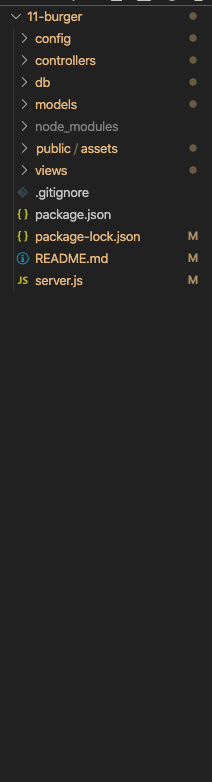
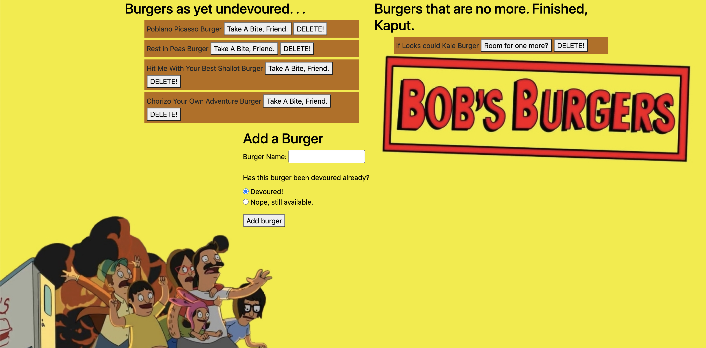

# 11-burger Eater

## Project Requirements

For this project, we needed to make a fun burger eating application that follows an MVC structure. (Models, Views, Controllers).
We're needing to build this all out from scratch, so while the finished application may look simple, there's actually a lot going on under the hood in order to have our burgers travel between the client side and the server.

At minimum, the app should let us do the following:

* Input the names of burgers 
* Burgers initially enter a staging area on the left side of the screen, where they're waiting to be devoured
* Burgers in the staging area have a "Devour" button which moves the burger to the right side of the page.
* Every burger entered by the user is stored in the database

## What We did

Following the project guidelines, we created an MVC structure for our database. The first thing I did was lay out the app's folder structure, as follows:

I followed through the [project guidelines](https://utoronto.bootcampcontent.com/utoronto-bootcamp/utor-tor-fsf-ft-09-2020-u-c/blob/master/13-MVC/02-Homework/Instructions/homework_instructions.md)

# Creating DB
I created my db, schema, and seeds.I then entered them into mysql workbench in order to create our database, create a table within it, and seed it with initial/test data.

# Config 
I then set up our connection.js file, which connects to our database, and an ORM file to run our SQL commands.

# Model Setup

I then created our Model (called "burger.js"). This model calls all our ORM functions.

# Controller 

Our burgers_controller is the router for our app. It runs our get, post, put and delete requests which allows data to travel between the client and server.

# Views

Views handles our HTML rendering. For this project, we used handlebars, which allows for dynamic html rendering without hardcoding, as it's a template engine.

# Tricky Stuff

We actually did need to write a javascript file (stored in Public/assets/js ) to send commands (delete, add burgers, etc) to our back end. This wasn't detailed in the homework overview, or directory structure, so i thought that was pretty trick!

## Installation

You'll need to run an npm install on the dependencies so use the following commands

``
npm init

``

`` npm install express express-handlebars mysql

``

This should set up our packages and install them

## Usage

From the terminal run the following command

``node server.js
``

or

``nodemon server.js
``

From there, if you're running it locally, navigate to localhost:3000 on your browser to access the app.

Otherwise, view the deployed app on heroku.

## Picture of the working app

